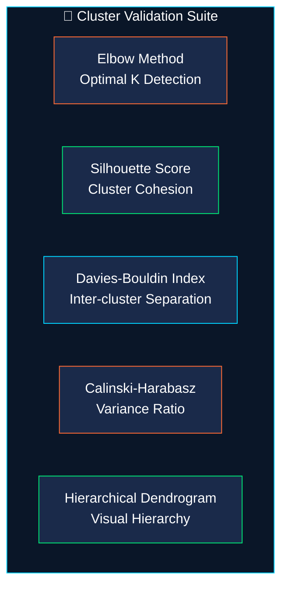
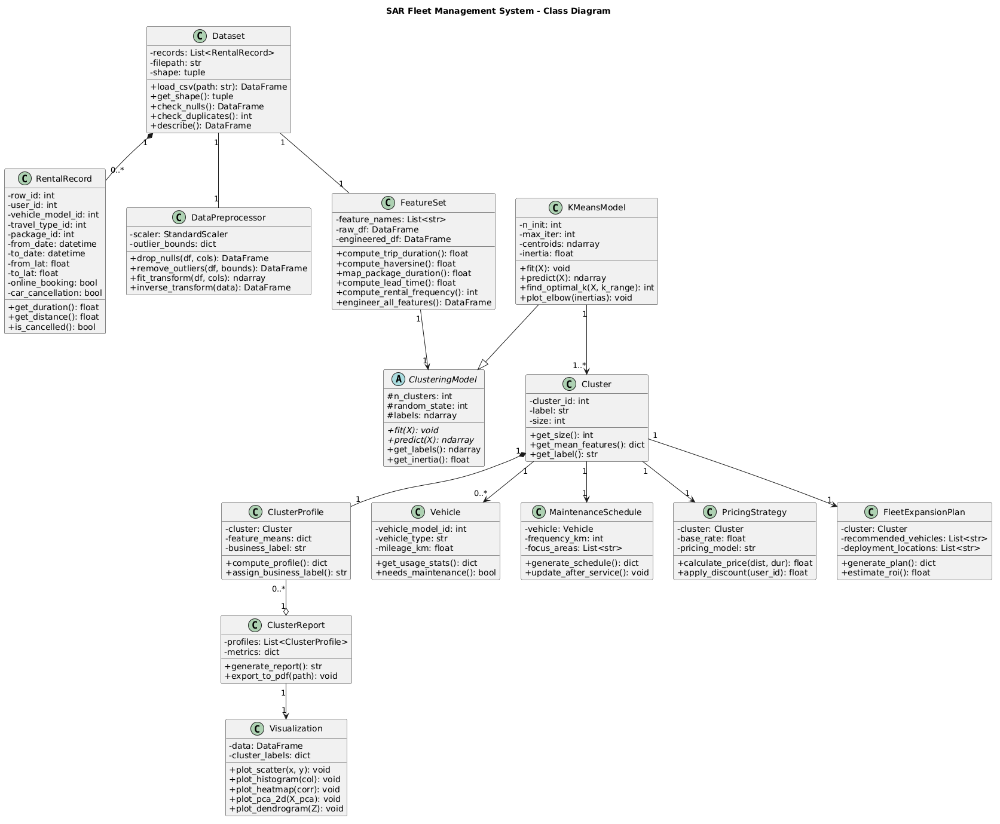
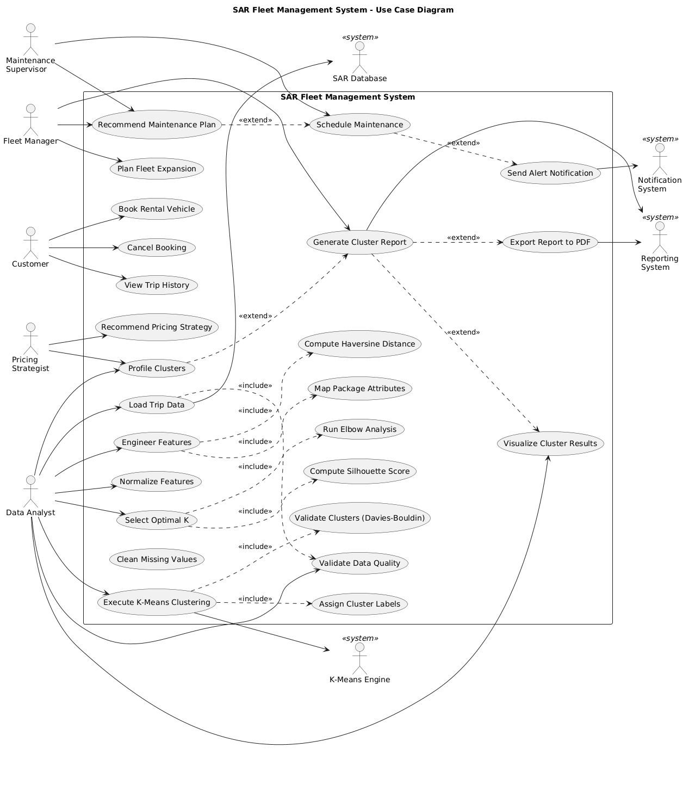

<p align="center">
  
</p>

<h1 align="center">🚗 SAR Fleet Clustering</h1>

<p align="center">
  <b>Intelligent Fleet Analytics Powered by K-Means Clustering</b><br>
  <i>Turning 10,000 raw car rental trips into actionable business intelligence</i>
</p>

<p align="center">
  <a href="#"></a>
  <a href="#"></a>
  <a href="#"></a>
  <a href="LICENSE"></a>
</p>

<br>

<div align="center">

| 🎯 **10,000 Trips Analyzed** | 📊 **8 Engineered Features** | 🧠 **3 Distinct Clusters** | 📈 **9-Phase Pipeline** |
|:---:|:---:|:---:|:---:|
| Real-world rental data from SAR San Francisco | Domain-specific features including Haversine distance | Well-separated behavioral segments | End-to-end from EDA to business strategy |

</div>

---

## 📌 About

The **SAR Fleet Clustering** project applies unsupervised machine learning to real-world car rental data from **SAR Rental Car Service** in San Francisco. Using K-Means clustering, we segment 10,000+ rental trips into distinct behavioral groups — enabling data-driven decisions for **maintenance scheduling**, **dynamic pricing**, and **strategic fleet expansion**.

> 💡 **Key Discovery**: Hourly Rental Packages and Point-to-Point GPS tracking are *mutually exclusive* features. Handling this through strategic zero-filling preserved natural travel-type distinctions, yielding robust, well-separated clusters.

---

## 🔬 Analysis Pipeline

The entire analysis follows a rigorous 9-phase methodology:

```mermaid
graph LR
    A["📥 Phase 1\nData Loading"] --> B["🔍 Phase 2\nExploration"]
    B --> C["⚙️ Phase 3\nFeature Engineering"]
    C --> D["🧹 Phase 4\nPreprocessing"]
    D --> E["📐 Phase 5\nOptimal K Selection"]
    E --> F["🧠 Phase 6\nK-Means Clustering"]
    F --> G["✅ Phase 7\nValidation"]
    G --> H["📊 Phase 8\nProfiling"]
    H --> I["💼 Phase 9\nBusiness Strategy"]

    style A fill:#0d2137,stroke:#00D4FF,color:#fff
    style B fill:#0d2137,stroke:#00D4FF,color:#fff
    style C fill:#0d2137,stroke:#FF6B35,color:#fff
    style D fill:#0d2137,stroke:#FF6B35,color:#fff
    style E fill:#0d2137,stroke:#00E676,color:#fff
    style F fill:#0d2137,stroke:#00E676,color:#fff
    style G fill:#0d2137,stroke:#00D4FF,color:#fff
    style H fill:#0d2137,stroke:#FF6B35,color:#fff
    style I fill:#0d2137,stroke:#00E676,color:#fff
```



---

## 🛠️ Feature Engineering

We engineered **8 domain-specific features** from the raw trip data to maximize clustering signal:

| # | Feature | Description | Method |
|:-:|---------|-------------|--------|
| 1 | **Trip Duration** | Total rental time in hours | `to_date - from_date` |
| 2 | **Haversine Distance** | Straight-line distance between pickup & dropoff | GPS coordinates → km |
| 3 | **Package Duration Map** | Numeric encoding of rental package types | Ordinal mapping |
| 4 | **Booking Lead Time** | Hours between booking creation and trip start | `from_date - booking_created` |
| 5 | **Rental Frequency** | Number of trips per user | User-level aggregation |
| 6 | **Is Cancelled** | Binary cancellation flag | Direct extraction |
| 7 | **Online Booking** | Digital vs. offline booking method | Direct extraction |
| 8 | **Travel Type** | Category of travel (point-to-point vs. hourly) | Direct extraction |

---

## 📊 Cluster Validation

The model's quality is validated using multiple industry-standard metrics:



---

## 🏗️ System Architecture

The analytical system is modeled using UML to demonstrate software engineering rigor:

<details>
<summary><b>📐 Class Diagram</b> — 12+ classes covering the full data pipeline</summary>
<br>
<p align="center">
  
</p>

> The class diagram models the entire system from `Dataset` ingestion through `DataPreprocessor`, `FeatureSet` engineering, `KMeansModel` clustering, to downstream business entities like `PricingStrategy`, `MaintenanceSchedule`, and `FleetExpansionPlan`.
</details>

<details>
<summary><b>🎭 Use Case Diagram</b> — Multi-actor system interactions</summary>
<br>
<p align="center">
  
</p>

> Maps interactions between **Fleet Managers**, **Data Analysts**, **Pricing Strategists**, **Customers**, and **Maintenance Supervisors** — with system actors including the K-Means Engine, SAR Database, Notification System, and Reporting System.
</details>

---

## 🚀 Quick Start

```bash
# Clone the repository
git clone https://github.com/Lord-Saruman/sar-rental-clustering.git
cd sar-rental-clustering

# Install dependencies
pip install pandas numpy scikit-learn matplotlib seaborn scipy

# Launch Jupyter
jupyter notebook SAR_Rental_Clustering.ipynb
```

Then select **Kernel → Restart & Run All** to execute the full pipeline.

---

## 🧰 Tech Stack

<p align="center">
  
  
  
  
  
  
  
</p>

---

## 📁 Project Structure

```
sar-rental-clustering/
├── 📓 SAR_Rental_Clustering.ipynb   # Main analysis notebook (9 phases)
├── 📊 SAR Rental.csv                # Source dataset (~10,000 trips)
├── 📄 README.md                     # You are here
├── 📜 LICENSE                       # MIT License
└── 🎨 assets/
    ├── banner.png                   # Project banner
    ├── class_diagram.png            # UML Class Diagram
    └── use_case_diagram.png         # UML Use Case Diagram
```

---

## 👤 Author

<table>
  <tr>
    <td align="center">
      <a href="https://github.com/Lord-Saruman">
        <br>
        <sub><b>Ameer</b></sub>
      </a><br>
      <sub>Solo Developer</sub>
    </td>
  </tr>
</table>

---

<p align="center">
  <b>⭐ If you found this project useful, consider giving it a star!</b><br>
  <sub>Built with 🧠 data science and ☕ caffeine</sub>
</p>
